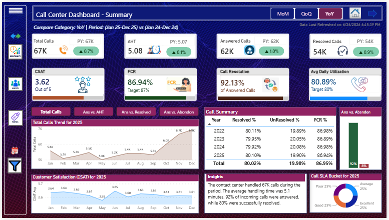
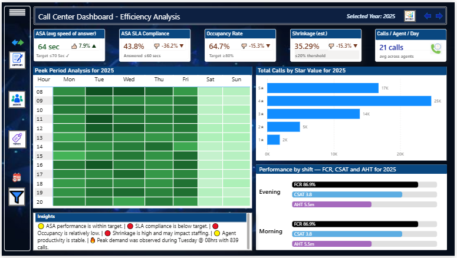
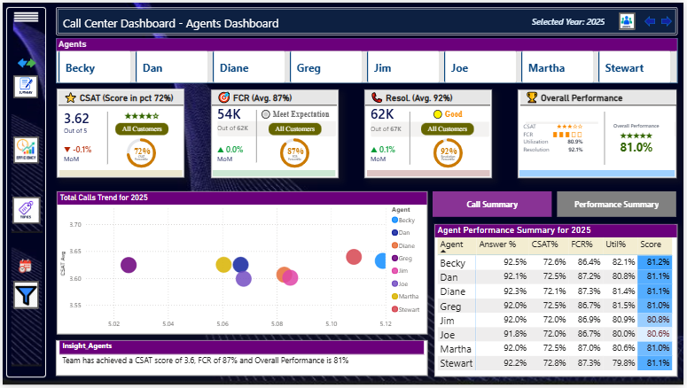
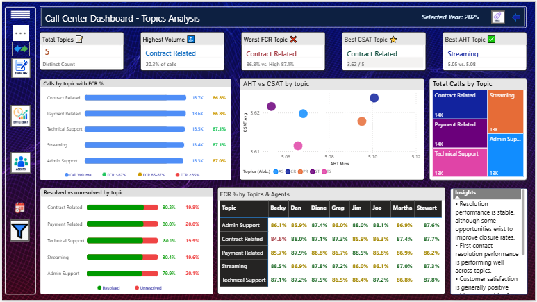
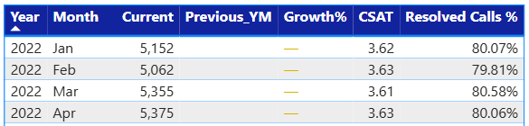
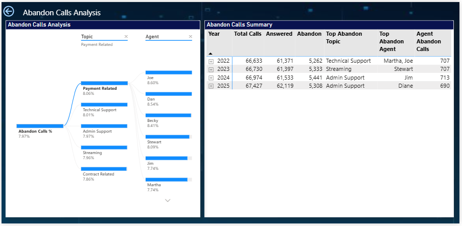

# Call Center Performance Dashboard

A Power BI portfolio project analyzing 4 years of synthetic call center data — built on a 9-table star schema with 150+ DAX measures, custom SVG-rendered KPI visuals, time-intelligence period comparison (MoM / QoQ / YoY), and drillthrough root-cause analysis.


---

## Table of contents

- [Overview](#overview)
- [Dashboard pages](#dashboard-pages)
- [Data model](#data-model)
- [Key DAX measures](#key-dax-measures)
- [Design decisions](#design-decisions)
- [Tech stack](#tech-stack)
- [How to use this file](#how-to-use-this-file)
- [Known limitations](#known-limitations)
- [About the data](#about-the-data)

---

## Overview

This project simulates a multi-year call center operation and builds an executive-to-operational reporting suite on top of it, covering:

- **Volume and SLA performance** — total calls, answered/abandoned, resolution rate, CSAT, FCR
- **Time-period comparison** — Month-over-Month, Quarter-over-Quarter, and Year-over-Year, switchable from a single slicer
- **Workforce efficiency** — average speed of answer (ASA), occupancy, shrinkage, and a call-volume heatmap by hour and day of week
- **Agent performance** — per-agent CSAT, FCR, resolution rate, and a composite performance score
- **Call driver analysis** — topic-level volume, FCR, AHT, and CSAT, including a topic × agent matrix
- **Root-cause drillthrough** — a decomposition tree for abandoned calls by topic and agent

**Dataset:** 4 years of synthetic call center records (Jan 2022 – Dec 2025), modeled after an Avaya WFM-style export. Fully synthetic — no real customer or company data.

---

## Dashboard pages

### 1. Summary
Executive KPI view with MoM/QoQ/YoY period comparison, trend charts, CSAT tracking, call resolution summary by year, and an auto-generated insight panel.



### 2. Efficiency analysis
Workforce metrics — ASA, SLA compliance, occupancy rate, and shrinkage — alongside an hour-by-day-of-week call volume heatmap and shift-level performance (FCR, CSAT, AHT for Morning/Evening/Night).



### 3. Agents dashboard
Per-agent CSAT, FCR, and resolution rate with a sortable performance table and a composite overall score.



### 4. Topics analysis
Call-driver breakdown: volume by topic with FCR overlay, an AHT-vs-CSAT scatter, a resolved/unresolved comparison, and a topic × agent FCR matrix.



### 5. Report tooltip
Custom hover tooltip showing month-by-month trend — current period, prior-year-month, growth %, CSAT, and resolved calls — without leaving the page.



### 6. Abandon calls drillthrough
A decomposition tree for root-causing abandoned calls, filterable by topic and agent, with a year-over-year summary of abandonment and the top contributing topic/agent.



---

## Data model

A star schema with one fact table and eight supporting dimension/utility tables.

```
                         ┌─────────────────┐
                         │   dim_calendar    │
                         │  Date, Year,      │
                         │  Month, Quarter   │
                         └─────────┬─────────┘
                                   │
┌──────────────┐         ┌────────┴─────────┐         ┌──────────────┐
│  dim_agents  ├─────────┤ fact_callcenter  ├─────────┤  dim_topics   │
│  Agent       │         │  (call grain)    │         │  Topic        │
└──────────────┘         └────────┬─────────┘         └──────────────┘
                                   │
                  ┌────────────────┼────────────────┐
                  │                │                 │
         ┌────────┴───────┐ ┌──────┴──────┐  ┌───────┴────────┐
         │   dim_time      │ │ dim_ratings  │  │  dim_Talk_SLA  │
         │  Hour, Shift    │ │  1★ – 5★     │  │  SLA bucket    │
         └─────────────────┘ └─────────────┘  └────────────────┘

         ┌─────────────────┐        ┌──────────────────┐
         │ Period Selector  │        │  last_refresh     │
         │  MoM / QoQ / YoY │        │  (disconnected,   │
         │  (disconnected)  │        │   refresh stamp)  │
         └──────────────────┘        └──────────────────┘
```

| Table | Role | Notes |
|---|---|---|
| `fact_callcenter` | Fact | One row per call. Pre-computed flags (`IsAnswered`, `IsResolved`), `TalkSeconds`, SLA bucket, and `TimeId` are all built in Power Query, not DAX. |
| `dim_calendar` | Dimension | Standard date table with Year/Quarter/Month hierarchy. |
| `dim_agents` | Dimension | Distinct agent list with a surrogate key. |
| `dim_topics` | Dimension | Distinct call topics with a surrogate key and short-form abbreviation column. |
| `dim_time` | Dimension | Hour (0–23) and Shift (Morning/Evening/Night) for time-of-day analysis. |
| `dim_ratings` | Dimension | 1–5 star scale with a star-glyph display column. |
| `dim_Talk_SLA` | Utility | Distinct SLA bucket labels. |
| `Period Selector` | Disconnected | Drives the MoM/QoQ/YoY slicer used across every KPI card. |
| `last_refresh` | Utility | Timestamp shown in the report header. |

See [`docs/data_dictionary.md`](docs/data_dictionary.md) for the full column-level reference.

---

## Key DAX measures

The model has 150+ measures. A representative selection — full list and explanations in [`dax/measures.md`](dax/measures.md).

```dax
FCR % =
DIVIDE(
    CALCULATE([Total Calls], fact_callcenter[IsResolved] = 1, fact_callcenter[IsAnswered] = 1),
    [Answered Calls],
    0
)
```

```dax
-- One of eight period-comparison measures driving the MoM/QoQ/YoY slicer
Calls_Curr_Total_Value =
VAR _Period = SELECTEDVALUE('Period Selector'[Period])
VAR _MaxDate = MAX(dim_calendar[Date])
VAR _AllMaxDate = CALCULATE(MAX(dim_calendar[Date]), ALL(dim_calendar[Date]))
RETURN
    SWITCH(
        TRUE(),
        _Period = "MoM", CALCULATE([Total Calls], DATESINPERIOD(dim_calendar[Date], _MaxDate, -1, MONTH)),
        _Period = "QoQ", CALCULATE([Total Calls], DATESINPERIOD(dim_calendar[Date], _MaxDate, -1, QUARTER)),
        _Period = "YoY", CALCULATE([Total Calls], DATESINPERIOD(dim_calendar[Date], _MaxDate, -1, YEAR))
    )
```

```dax
-- Renders a CSAT ring as an inline SVG image, built entirely in DAX
'SVG CSAT Ring' =
VAR _csat = [CSAT Avg]
VAR _pct = DIVIDE(_csat, 5, 0)
VAR _angle = _pct * 360
RETURN
    "data:image/svg+xml;utf8," & "<svg ...>" & "</svg>"
```

**Notable patterns used in this project:**
- A disconnected `Period Selector` table drives MoM/QoQ/YoY across every KPI from a single slicer, instead of building separate visuals per period.
- KPI rings, bar charts, and shift-performance visuals are rendered as DAX-generated SVG strings, not native Power BI visuals.
- All boolean flags and bucketing (`IsAnswered`, `IsResolved`, SLA bucket, hour-of-day) are computed once in Power Query and reused across every measure, rather than recomputed in DAX at query time.

---

## Design decisions

**Why a 9-table star schema instead of one flat table?**
A single denormalized table would have made early development faster, but it breaks down the moment you need independent filtering — e.g., filtering by agent without losing the topic-level FCR context. Splitting agents, topics, time, and ratings into their own dimensions keeps every slicer independent and keeps the fact table narrow.

**Why a disconnected `Period Selector` table instead of three separate measure sets?**
Building MoM, QoQ, and YoY as three permanently separate measures would have tripled the visual count on the Summary page. A single disconnected table with a `SELECTEDVALUE()` switch inside each measure lets one set of KPI cards serve all three comparison modes from one slicer — at the cost of every period-comparison measure carrying a `SWITCH()` branch it doesn't always need.

**Where I'd trade off differently next time:**
The eight `_Curr_`/`_Prev_` period-comparison measures (one pair per KPI) duplicate the same `DATESINPERIOD`/`SWITCH` scaffold with only the base measure swapped each time — about 500 lines that could be one parameterized measure. It was the right call for shipping speed at this project's scale, but it's the first thing I'd refactor if the table count grew.

---

## Tech stack

- **Power BI Desktop** — data modeling, DAX, report design
- **Power Query (M)** — data cleaning, type casting, derived columns
- **DAX** — 150+ measures including time intelligence and SVG-rendered visuals
- **TMDL** — model defined in Tabular Model Definition Language for version control readability

---

## How to use this file

1. Clone this repository.
2. Open `Call_Center_Dashboard.pbix` in Power BI Desktop.
3. The data source points to a local CSV. Go to **Transform data → Data source settings** and repoint it to `data/Avaya_WFM_4_Years_Synthetic_Data.csv` in this repo.
4. Click **Refresh**.

> **Note:** The file path is currently hardcoded to a local machine. If you open the `.pbix` without repointing the source, you'll see a "couldn't find file" error on first load — this is expected and fixed by step 3.

---

## Known limitations

- The data source path must be manually repointed after cloning (see above).
- The 4-year dataset is synthetic and was not validated against a real-world call center benchmark dataset; KPI targets (e.g., ASA ≤ 70s, FCR ≥ 85%) were chosen to be industry-plausible, not derived from a specific organization.
- The period-comparison DAX engine is functionally correct but duplicated across 8 KPIs rather than parameterized — see [Design decisions](#design-decisions).

---

## About the data

All data in this project is **synthetic** and was generated for portfolio/learning purposes. It does not represent any real company, call center, or individual. "Avaya WFM" in the source filename refers to the *style* of export the data was modeled after, not an actual Avaya data extract.

---

## License

This project is licensed under the [MIT License](LICENSE).
